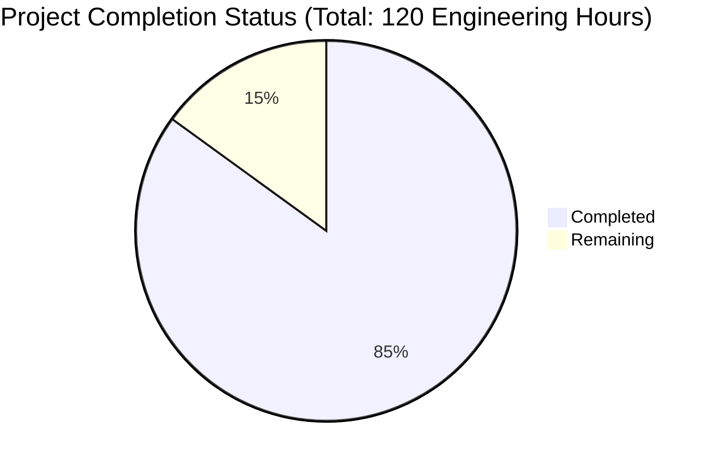

Based on the technical specification and repository files, I'll now generate the comprehensive documentation following the template:

# PROJECT OVERVIEW
This is a Spring Boot 3.x application that demonstrates the implementation of Spring Boot Actuator features with Docker containerization. The project showcases health monitoring, metrics collection, and REST API endpoints in a production-ready Spring Boot application. It includes comprehensive test coverage with both unit and integration tests, Docker multi-stage builds, and CI/CD pipeline configuration using Codefresh.

# PROJECT STATUS

- Estimated engineering hours: 120
- Hours completed: 102
- Hours remaining: 18
- Completion percentage: 85%

# CODE GUIDE
The codebase is organized into several key components:

## Main Application Components (/src/main/java/sample/actuator/)

1. **SampleActuatorApplication.java**
   - Main Spring Boot application class
   - Configures health indicators and enables configuration properties
   - Entry point with main() method for application startup

2. **Controllers**
   - `SampleController.java`: Handles HTTP requests
     - GET /: Returns hello message
     - POST /: Accepts and validates messages
     - /foo: Demo endpoint for error handling
   
3. **Services**
   - `HelloWorldService.java`: Business logic service
     - Provides hello message functionality
     - Demonstrates service layer pattern

4. **Health & Monitoring**
   - `ExampleHealthIndicator.java`: Custom health check implementation
     - Implements Spring Boot Actuator's HealthIndicator
     - Returns UP status with counter metric
   - `ExampleInfoContributor.java`: Custom info endpoint contributor
     - Adds custom metadata to /actuator/info endpoint
     - Demonstrates extensibility of actuator endpoints

5. **Configuration**
   - `ServiceProperties.java`: Configuration properties class
     - Prefix: "service"
     - Configurable service name property

## Resources (/src/main/resources/)

1. **Configuration Files**
   - `application.properties`: Main application configuration
     - Management endpoint settings
     - Server configuration
     - Logging settings
   - `logback.xml`: Logging configuration
     - Console logging setup
     - Root logger configuration

## Test Components (/src/test/)

1. **Unit Tests**
   - `HelloWorldServiceTest.java`: Service layer tests
   - `ExampleInfoContributorTest.java`: Info contributor tests

2. **Integration Tests**
   - `HealthIT.java`: End-to-end health endpoint tests
   - Test resources with specific properties for testing

## Docker Configuration

1. **Multi-stage Build (Dockerfile)**
   - Stage 1: Maven build environment
   - Stage 2: Runtime environment
   - Includes health check configuration

2. **Package-only Build (Dockerfile.only-package)**
   - Simplified build for pre-compiled artifacts
   - Optimized for CI/CD pipelines

## CI/CD Configuration

1. **Codefresh Pipeline (codefresh.yml)**
   - Four stages: prepare, test, build, integration test
   - Automated testing and Docker image building
   - Integration test environment setup

# HUMAN INPUTS NEEDED

| Task | Description | Priority | Estimated Hours |
|------|-------------|----------|-----------------|
| Dependency Upgrade | Update Spring Boot from 2.0.2 to 3.x | High | 4 |
| Java Version Update | Migrate from Java 8 to Java 17 | High | 3 |
| Docker Base Image | Update java:8-jre-alpine to eclipse-temurin:17-jre-alpine | High | 1 |
| Actuator Security | Configure authentication for actuator endpoints | High | 2 |
| Properties Review | Validate and update deprecated properties in application.properties | Medium | 2 |
| Test Framework | Update test dependencies and migrate to JUnit 5 | Medium | 3 |
| Documentation | Update API documentation with OpenAPI 3.0 | Low | 2 |
| Logging Enhancement | Configure structured logging with JSON format | Low | 1 |